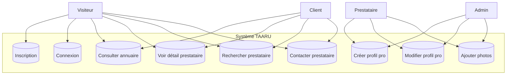

# ÉTAPE 2 — ANALYSE

## 1. Diagramme de cas d'utilisation — Incrément 1

---

## 2. User stories — Incrément 1

### US-1.1 — Setup du projet ✅ (terminé)

---

### US-1.2.1 — Inscription utilisateur

**En tant que** visiteur  
**Je veux** créer un compte avec mon email et mot de passe  
**Afin de** pouvoir gérer mon profil et accéder aux fonctionnalités réservées

**Critères d'acceptation** :
- [ ] Formulaire avec : email, mot de passe (min 8 car., 1 maj, 1 chiffre), prénom, nom
- [ ] Validation côté client + serveur
- [ ] Email vérifié après inscription (lien de confirmation)
- [ ] Choix du rôle : CLIENT ou PROFESSIONAL
- [ ] Message d'erreur clair si email déjà utilisé
- [ ] Rate limiting : max 3 tentatives par minute
- [ ] Pas d'accès aux routes protégées tant que email non vérifié

---

### US-1.2.2 — Connexion / Déconnexion

**En tant que** utilisateur enregistré  
**Je veux** me connecter avec email et mot de passe  
**Afin de** accéder à mon espace personnel

**Critères d'acceptation** :
- [ ] Connexion par email + mot de passe
- [ ] JWT access token (15 min) + refresh token (7 jours)
- [ ] Refresh token rotatif (l'ancien est invalidé après usage)
- [ ] Déconnexion invalide le refresh token côté serveur
- [ ] Message d'erreur si mauvais identifiants (sans préciser lequel)
- [ ] Blocage après 5 échecs consécutifs (15 min)

---

### US-1.2.3 — Profil utilisateur basique

**En tant que** utilisateur connecté  
**Je veux** voir et modifier mes informations personnelles  
**Afin de** gérer mon compte

**Critères d'acceptation** :
- [ ] Afficher : email, prénom, nom, téléphone, rôle, date d'inscription
- [ ] Modifier : prénom, nom, téléphone
- [ ] Changer mot de passe (avec ancien mot de passe requis)
- [ ] Supprimer mon compte (confirmation requise)

---

### US-1.3.1 — Création de profil prestataire

**En tant que** utilisateur (rôle PROFESSIONAL ou ADMIN)  
**Je veux** créer une page professionnelle avec mes informations  
**Afin de** être visible dans l'annuaire TAARU

**Critères d'acceptation** :
- [ ] Informations requises : nom commercial, catégorie, description, ville, téléphone
- [ ] Informations optionnelles : adresse, WhatsApp, site web, réseaux sociaux
- [ ] Logo obligatoire (format carré, max 2 Mo)
- [ ] Au moins 1 photo de galerie obligatoire (max 5 Mo)
- [ ] Validation : catégorie parmi la liste prédéfinie
- [ ] Page non visible dans l'annuaire tant que le profil n'est pas complet
- [ ] Un utilisateur ne peut avoir qu'un seul profil pro

---

### US-1.3.2 — Modification du profil prestataire

**En tant que** prestataire  
**Je veux** modifier ma page professionnelle  
**Afin de** maintenir mes informations à jour

**Critères d'acceptation** :
- [ ] Modifier tous les champs du profil
- [ ] Ajouter/supprimer des photos (max 5 dans la version gratuite)
- [ ] Réordonner les photos de la galerie
- [ ] Mettre à jour les tarifs
- [ ] Modifier les horaires d'ouverture (optionnel)

---

### US-1.4.1 — Page d'accueil avec annuaire

**En tant que** visiteur  
**Je veux** voir une page d'accueil avec les prestataires mis en avant  
**Afin de** découvrir rapidement ce que propose TAARU

**Critères d'acceptation** :
- [ ] Bannière avec le slogan TAARU
- [ ] Barre de recherche en évidence
- [ ] Section "Prestataires à la une" (max 6 profils sélectionnés)
- [ ] Section "Catégories" avec les 4 domaines (Mode, Couture, Beauté, Événementiel)
- [ ] Design mobile-first responsive
- [ ] Temps de chargement < 2s

---

### US-1.4.2 — Liste des prestataires par catégorie

**En tant que** visiteur  
**Je veux** filtrer les prestataires par catégorie  
**Afin de** trouver rapidement des professionnels dans le domaine qui m'intéresse

**Critères d'acceptation** :
- [ ] Navigation par : Mode, Couture, Beauté, Événementiel
- [ ] Sous-catégories affichées dans chaque domaine
- [ ] Affichage en grille (carte avec photo, nom, ville, note)
- [ ] Pagination (12 par page)
- [ ] Tri par : popularité, note, date d'ajout

---

### US-1.4.3 — Page détail prestataire

**En tant que** visiteur  
**Je veux** voir la fiche complète d'un prestataire  
**Afin de** décider si je veux le contacter

**Critères d'acceptation** :
- [ ] Galerie photos (lightbox)
- [ ] Nom commercial, description, catégorie, ville
- [ ] Téléphone, WhatsApp (liens cliquables)
- [ ] Bouton "Contacter" (ouvre WhatsApp ou formulaire)
- [ ] Localisation (carte + adresse)
- [ ] Tarifs affichés
- [ ] Design responsive

---

### US-1.4.4 — Recherche

**En tant que** visiteur  
**Je veux** rechercher des prestataires par mot-clé, ville ou catégorie  
**Afin de** trouver précisément ce que je cherche

**Critères d'acceptation** :
- [ ] Recherche par : nom, ville, catégorie, mot-clé
- [ ] Résultats affichés en temps réel (debounce 300ms)
- [ ] Pas de résultat : message "Aucun prestataire trouvé"
- [ ] Recherche fonctionnelle sans authentification

---

### US-1.4.5 — Contacter un prestataire

**En tant que** visiteur  
**Je veux** contacter un prestataire via WhatsApp ou formulaire  
**Afin de** demander un devis ou poser une question

**Critères d'acceptation** :
- [ ] Bouton WhatsApp : lien direct vers le numéro du prestataire
- [ ] Formulaire de contact : nom, email, message
- [ ] Confirmation d'envoi (toast ou redirect)
- [ ] Le prestataire reçoit un email de notification
- [ ] Rate limiting : max 5 messages par heure par IP

---

### US-1.5 — PWA (Progressive Web App)

**En tant que** visiteur  
**Je veux** installer TAARU sur l'écran d'accueil de mon téléphone  
**Afin de** y accéder comme une application native

**Critères d'acceptation** :
- [ ] Manifeste valide (nom, icônes, couleurs)
- [ ] Service Worker enregistré
- [ ] Invitation à installer (beforeinstallprompt)
- [ ] Page de fallback hors-ligne basique
- [ ] Temps de chargement au premier appel < 3s
