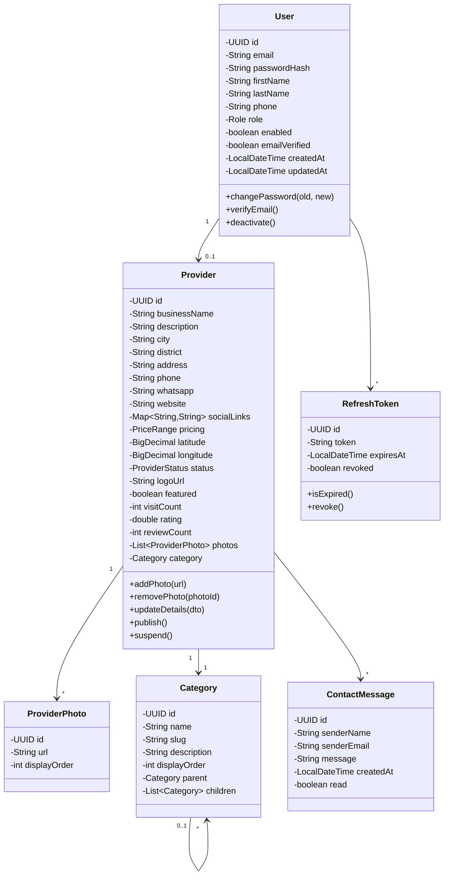

# ÉTAPE 3 — CONCEPTION

## 1. Schéma de base de données

```mermaid
erDiagram
    users {
        uuid id PK
        varchar email UK
        varchar password_hash
        varchar first_name
        varchar last_name
        varchar phone
        varchar role "CLIENT | PROFESSIONAL | ADMIN"
        boolean enabled
        boolean email_verified
        timestamp created_at
        timestamp updated_at
    }

    categories {
        uuid id PK
        varchar name
        varchar slug UK
        text description
        uuid parent_id FK "null pour catégorie racine"
        int display_order
    }

    providers {
        uuid id PK
        uuid user_id FK UK
        varchar business_name
        uuid category_id FK
        varchar subcategory
        text description
        varchar city
        varchar district
        varchar address
        varchar phone
        varchar whatsapp
        varchar website
        jsonb social_links "{\"instagram\":\"...\",\"facebook\":\"...\"}"
        jsonb pricing "{\"min\":5000,\"max\":50000}"
        decimal latitude
        decimal longitude
        varchar status "PENDING | ACTIVE | SUSPENDED"
        varchar logo_url
        boolean featured
        int visit_count
        float rating
        int review_count
        timestamp created_at
        timestamp updated_at
    }

    provider_photos {
        uuid id PK
        uuid provider_id FK
        varchar url
        int display_order
        timestamp created_at
    }

    provider_business_hours {
        uuid id PK
        uuid provider_id FK
        varchar day_of_week "MONDAY...SUNDAY"
        time open_time
        time close_time
        boolean is_closed
    }

    refresh_tokens {
        uuid id PK
        uuid user_id FK
        varchar token
        timestamp expires_at
        timestamp created_at
        boolean revoked
    }

    contact_messages {
        uuid id PK
        uuid provider_id FK
        varchar sender_name
        varchar sender_email
        text message
        timestamp created_at
        boolean read
    }

    users ||--o{ providers : "a"
    providers ||--o{ provider_photos : "has"
    providers ||--o{ provider_business_hours : "has"
    providers ||--o{ contact_messages : "receives"
    providers }o--|| categories : "belongs_to"
    categories ||--o{ categories : "parent"
    users ||--o{ refresh_tokens : "has"
```

---

## 2. Diagramme de classes (Domaine)



---

## 3. API REST — Endpoints (Incrément 1)

### Auth
| Méthode | URL | Auth | Description |
|---------|-----|------|-------------|
| POST | `/api/auth/register` | Non | Inscription |
| POST | `/api/auth/login` | Non | Connexion |
| POST | `/api/auth/refresh` | Non | Rafraîchir token |
| POST | `/api/auth/logout` | Oui | Déconnexion |

### Users
| Méthode | URL | Auth | Description |
|---------|-----|------|-------------|
| GET | `/api/users/me` | Oui | Profil |
| PUT | `/api/users/me` | Oui | Modifier profil |
| PUT | `/api/users/me/password` | Oui | Changer mot de passe |
| DELETE | `/api/users/me` | Oui | Supprimer compte |

### Providers
| Méthode | URL | Auth | Description |
|---------|-----|------|-------------|
| GET | `/api/providers` | Non | Lister (avec filtres) |
| GET | `/api/providers/featured` | Non | Prestataires à la une |
| GET | `/api/providers/categories` | Non | Lister catégories |
| GET | `/api/providers/{id}` | Non | Détail prestataire |
| POST | `/api/providers` | Oui | Créer profil pro |
| PUT | `/api/providers/{id}` | Oui | Modifier profil pro |
| POST | `/api/providers/{id}/photos` | Oui | Ajouter photo |
| DELETE | `/api/providers/{id}/photos/{photoId}` | Oui | Supprimer photo |
| POST | `/api/providers/{id}/contact` | Non | Contacter prestataire |

### Admin
| Méthode | URL | Auth | Description |
|---------|-----|------|-------------|
| GET | `/api/admin/providers` | Admin | Lister tous les pros |
| PUT | `/api/admin/providers/{id}/status` | Admin | Activer/suspendre |

---

## 4. Arborescence des routes (Next.js App Router)

```
src/app/
├── page.tsx                          ← Accueil
├── layout.tsx                        ← Root layout
├── globals.css
├── providers/
│   ├── page.tsx                      ← Annuaire (liste + recherche)
│   ├── [id]/
│   │   └── page.tsx                  ← Détail prestataire
│   └── categories/
│       └── [slug]/
│           └── page.tsx              ← Liste par catégorie
├── auth/
│   ├── register/
│   │   └── page.tsx                  ← Inscription
│   └── login/
│       └── page.tsx                  ← Connexion
└── dashboard/
    ├── page.tsx                      ← Dashboard prestataire
    ├── edit/
    │   └── page.tsx                  ← Modifier profil pro
    └── layout.tsx                    ← Layout protégé (AuthGuard)
```

---

## 5. Arbre des composants React

```
src/components/
├── layout/
│   ├── Header.tsx                    ← Logo + navigation + auth
│   ├── Footer.tsx                    ← Liens légaux + contact
│   ├── MobileNav.tsx                 ← Navigation mobile
│   └── AuthGuard.tsx                 ← Protection routes (HOC ou wrapper)
├── ui/
│   ├── Button.tsx                    ← Bouton réutilisable
│   ├── Input.tsx                     ← Champ formulaire
│   ├── Select.tsx                    ← Liste déroulante
│   ├── Modal.tsx                     ← Modale générique
│   ├── Toast.tsx                     ← Notifications temporaires
│   ├── Spinner.tsx                   ← Loader
│   ├── Card.tsx                      ← Carte générique
│   └── Badge.tsx                     ← Badge (catégorie, statut)
├── providers/
│   ├── ProviderCard.tsx              ← Carte prestataire (grille)
│   ├── ProviderGrid.tsx              ← Grille de cartes
│   ├── ProviderDetail.tsx            ← Page détail (section principale)
│   ├── PhotoGallery.tsx              ← Galerie avec lightbox
│   ├── ContactForm.tsx               ← Formulaire de contact
│   ├── ProviderMap.tsx               ← Carte de localisation
│   └── ProviderFilters.tsx           ← Filtres de recherche
├── auth/
│   ├── RegisterForm.tsx              ← Formulaire inscription
│   ├── LoginForm.tsx                 ← Formulaire connexion
│   └── UserMenu.tsx                  ← Menu utilisateur connecté
└── dashboard/
    ├── ProfileForm.tsx               ← Formulaire profil pro
    ├── PhotoUpload.tsx               ← Upload photos
    ├── PhotoManager.tsx              ← Gestion galerie
    └── StatsCard.tsx                 ← Carte statistiques
```
